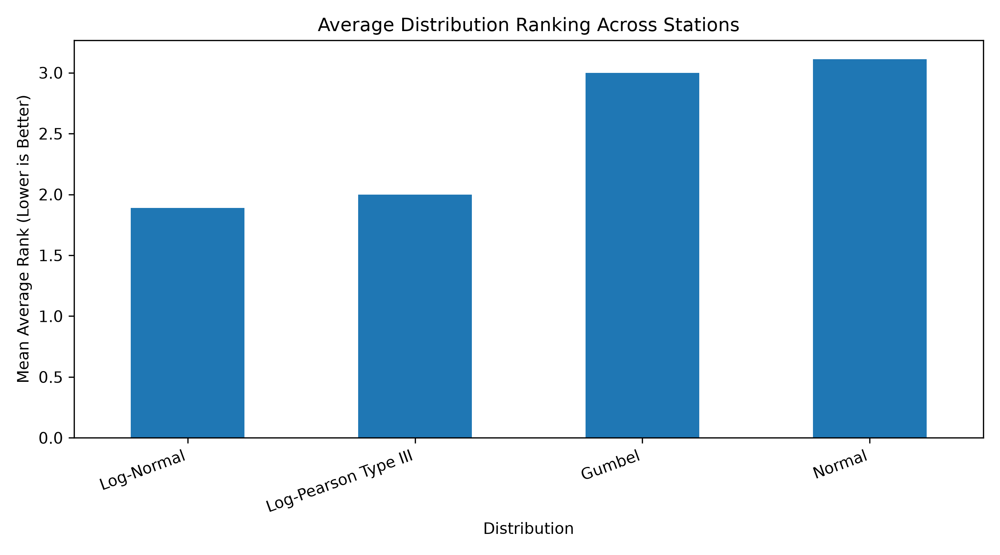
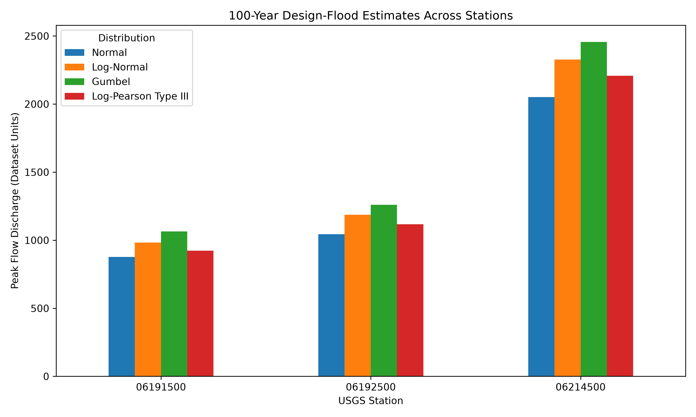

# Flood Frequency Analysis

## Overview

This project performs flood frequency analysis using annual maximum peak-flow data from three USGS streamflow stations. Four probability distributions are fitted and compared:

- Normal
- Log-Normal
- Gumbel
- Log-Pearson Type III

The fitted distributions are used to estimate flood discharges for different return periods. Their performance is evaluated using goodness-of-fit tests and an average ranking method.

## Study Stations

- USGS 06191500
- USGS 06192500
- USGS 06214500

The analysis uses 71 years of annual peak-flow records from 1950 to 2020. Discharge values are expressed in cubic metres per second (m³/s).

## Workflow

1. Download annual peak-flow data from USGS.
2. Clean and prepare the datasets.
3. Calculate descriptive statistics.
4. Fit four probability distributions.
5. Estimate flood discharges for 2- to 200-year return periods.
6. Evaluate the distributions using the Kolmogorov–Smirnov test, chi-square test, and RMSE.
7. Rank the distributions and compare results across stations.
8. Export result tables and figures.

The 200-year return period is included mainly to compare the upper-tail behaviour of the fitted distributions. Because it extends well beyond the 71-year record, it should be interpreted with greater uncertainty.

## Main Findings

| USGS station | Best overall distribution |
|---|---|
| 06191500 | Log-Normal / Log-Pearson Type III |
| 06192500 | Log-Normal / Log-Pearson Type III |
| 06214500 | Log-Normal |

Log-Normal was the most consistent distribution across the three stations and produced the lowest RMSE at each station. Log-Pearson Type III generally produced the best Kolmogorov–Smirnov results.

All four distributions passed the selected goodness-of-fit tests at the 5% significance level. However, their estimated flood discharges became increasingly different at longer return periods. Gumbel generally produced the highest estimates, while Normal produced the lowest.

## Key Results

### Overall Distribution Ranking



*Lower average rank indicates better overall performance.*

### 100-Year Flood Comparison



*The estimated 100-year flood varies depending on the selected probability distribution.*

## Project Structure

```text
Flood-Frequency-Analysis/
│
├── README.md
├── LICENSE
├── requirements.txt
├── .gitignore
│
├── 01_data_download.ipynb
├── 02_data_cleaning.ipynb
├── 03_descriptive_statistics.ipynb
├── 04_flood_frequency_analysis_visualization.ipynb
├── 05_cross_station_comparison.ipynb
│
├── data/
│   ├── raw/
│   │   ├── usgs_06191500_annual_peak_flow.rdb
│   │   ├── usgs_06192500_annual_peak_flow.rdb
│   │   └── usgs_06214500_annual_peak_flow.rdb
│   │
│   └── processed/
│       ├── usgs_06191500_annual_peak_flow_clean.csv
│       ├── usgs_06192500_annual_peak_flow_clean.csv
│       └── usgs_06214500_annual_peak_flow_clean.csv
│
└── outputs/
    ├── 06191500/
    │   ├── figures/
    │   ├── combined_distribution_parameters.csv
    │   ├── design_flood_estimates.csv
    │   ├── distribution_ranking.csv
    │   └── goodness_of_fit_results.csv
    │
    ├── 06192500/
    │   ├── figures/
    │   ├── combined_distribution_parameters.csv
    │   ├── design_flood_estimates.csv
    │   ├── distribution_ranking.csv
    │   └── goodness_of_fit_results.csv
    │
    ├── 06214500/
    │   ├── figures/
    │   ├── combined_distribution_parameters.csv
    │   ├── design_flood_estimates.csv
    │   ├── distribution_ranking.csv
    │   └── goodness_of_fit_results.csv
    │
    └── cross_station/
        ├── figures/
        │   ├── cross_station_average_rank.png
        │   ├── lognormal_cross_station_comparison.png
        │   └── q100_distribution_comparison.png
        │
        ├── combined_design_flood_estimates.csv
        ├── combined_distribution_rankings.csv
        ├── combined_goodness_of_fit_results.csv
        └── multi_station_summary.csv
```

## Requirements

- Python
- NumPy
- Pandas
- SciPy
- Matplotlib
- Requests
- Jupyter Notebook

Install the required packages using:

```bash
python -m pip install -r requirements.txt
```

## Running the Project

Run the notebooks in numerical order:

```text
01_data_download.ipynb
02_data_cleaning.ipynb
03_descriptive_statistics.ipynb
04_flood_frequency_analysis_visualization.ipynb
05_cross_station_comparison.ipynb
```

The final notebook combines the station-level results and creates the cross-station summary tables and figures.

## Data Source

Annual peak-flow data were obtained from the United States Geological Survey National Water Information System.

## Limitations

The analysis assumes that the annual peak-flow records are stationary and independent. Confidence intervals, trend analysis, regional skew, historical flood information, and climate-related changes are not included.

The results are intended for learning and research purposes. They should not be used directly for final engineering design without further analysis and professional assessment.

## License

This project is licensed under the MIT License. 

## Author

**Mandip Shrestha**  

